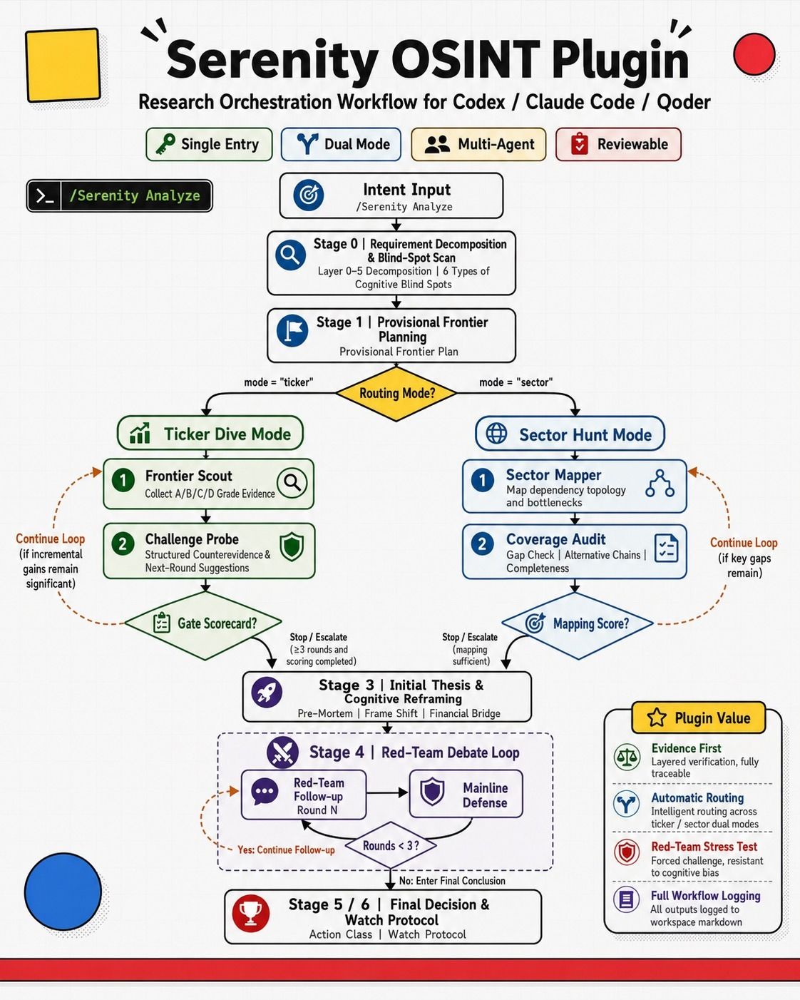

# SOFA

**[中文](README_CN.md) | [English](README.md)**



SOFA is the **serenitive osint framework analyzor**: an open-source, agent-assisted OSINT research framework for technology stocks and technology sectors.

It is built for educated readers who can evaluate technology and business arguments, but do not want a black-box stock screener. SOFA helps an agent map supply-chain dependencies, test bottleneck claims, translate technical constraints into financial implications, and write a readable investment-research report with an audit trail.

SOFA is designed to turn broad technology-investing questions into four concrete research questions:

| Question | What SOFA forces the research to show |
|----------|----------------------------------------|
| Where is the constraint? | The supply-chain layer, physical dependency, customer qualification path, or regulatory bottleneck that could matter. |
| How strong is the evidence? | The source quality, freshness, claim status, and unresolved gaps behind each important assertion. |
| Can it become financial reality? | The revenue bridge, margin path, cash-flow impact, dilution risk, valuation context, and catalyst clock. |
| What would break the thesis? | The strongest counterarguments, invalidation triggers, alternative suppliers, technical substitutions, and timing risks. |

SOFA is not an auto-trading tool and not a black box that turns a ticker into a buy or sell call. It supports two onion-peeling research jobs:

| Mode | Question | SOFA deliverable |
|------|----------|------------------|
| Ticker Dive | Is this company a real chokepoint in an AI or hard-tech supply chain? | Evidence chain, financial bridge, red-team challenge, invalidation conditions, watch protocol, and final research report |
| Sector Hunt | Which parts of an industry are most likely to contain underfollowed bottleneck companies? | Dependency map, chokepoint scoring matrix, ranked candidate queue, and next-dive recommendations |
| Sector-to-Ultra | How do we turn a Sector Hunt recommendation list into single-name deep-dive work? | Ultra Dive packets that feed the stricter Ticker Dive workflow |

## Who Is Serenity, And Why Start There?

Serenity / [@aleabitoreddit](https://x.com/aleabitoreddit) is a public investor and AI / semiconductor supply-chain research persona known for work on AI infrastructure, optical interconnects, CPO, materials, and physical bottlenecks. The useful part is not any single public call. It is the observable research motion: start from real downstream demand, trace the stack upstream through chips, optics, lasers, substrates, epiwafers, raw materials, and specialized tools, then ask which small physical node could tax or delay a much larger buildout.

SOFA is inspired by that public research pattern. It is not affiliated with Serenity, and it does not endorse self-reported returns, holdings, or social-media narratives. The repo focuses on the method: how to turn chokepoint discovery into an evidence-first, falsifiable, auditable research process that a modern agent can help execute.

## What Does SOFA Do?

- **Decomposes technology sectors.** Start from end demand and work backward into materials, equipment, qualification, customers, and regulatory constraints.
- **Translates stories into evidence.** Every material claim must land in an evidence ledger before it can support a thesis.
- **Separates discovery from conviction.** Sector Hunt produces maps and ranked queues only; a later Ticker Dive or Ultra Dive is required before any action-class language.
- **Manages frontier lifecycle.** Stage 2 frontiers can be added, retired, continued, and reactivated through deterministic checks instead of staying as a frozen Stage 1 list.
- **Keeps the research trail visible.** Each workspace stores `research_workflow.md`, `evidence_ledger.md`, `claim_ledger.md`, `search_log.md`, gate checks, method-card traces, and final reports.
- **Writes for decision makers.** Reports start with the conclusion, key evidence, strongest counterargument, and next step, then move the audit trail into the body and appendix.

## Why A Harness, Not Just A Skill?

Many agent skills try to compress an entire investing style into one callable prompt. That is convenient, but it creates predictable failure modes: the agent can skip steps when the context gets long, mix search with thesis formation, over-trust weak evidence, forget what was already checked, or produce a polished report without a visible audit trail.

SOFA is built as a harness instead. The user still starts from one entrypoint, but the work is split across an orchestrated system:

| Layer | What it does | Why it matters |
|-------|--------------|----------------|
| Router | Chooses Ticker Dive, Sector Hunt, or Sector-to-Ultra from the user's research intent. | The workflow changes depending on whether the user is studying one company or mapping a whole sector. |
| Mode guides | Define the step-by-step research loop for each mode. | The agent does not improvise the order of framing, mapping, challenge, financial bridge, red-team, and report writing. |
| Private method cards | Give subagents specific methods for supply-chain mapping, customer discovery, financial bridge, and red-team work. | The user does not directly call half-context methods; the main workflow controls when and why each method is used. |
| Deterministic gates | Run scripts for workspace setup, stage checks, loop enforcement, and dossier validation. | Important checks are handled by code, not by the agent's memory or confidence. |
| Durable workspace | Writes evidence, claims, searches, worker outputs, scorecards, and reports to files. | The research can be reviewed, resumed, challenged, and improved later. |
| Host adapters | Map the same core workflow to Codex, Claude Code, and generic agent environments. | SOFA is not tied to one vendor's tool names or one runtime. |

## How The Agent Loop Works

SOFA borrows from the intelligence cycle: direction, collection, processing, analysis, dissemination, and feedback. In investment research terms, that becomes a loop that keeps pushing the evidence frontier forward instead of jumping from first impression to final thesis.

| Loop step | In SOFA |
|-----------|---------|
| Direction | Clarify the research question, choose Ticker Dive or Sector Hunt, decompose demand from end market to upstream constraints. |
| Collection | Search for filings, company disclosures, technical documents, customer traces, market data, and credible contrary evidence. |
| Processing | Grade evidence, separate confirmed facts from inferred claims, and update ledgers. |
| Analysis | Build the dependency ladder, chokepoint map, financial bridge, and provisional thesis. |
| Challenge | Run Challenge Probe, Coverage Challenge, and formal Red Team before conviction language is allowed. |
| Dissemination | Produce a reader-ready report plus watch protocol, with the audit trail still available. |
| Feedback | Decide whether to continue, pivot, fork the frontier, generate Ultra Dive packets, or stop for missing primary evidence. |

This is the core design difference: SOFA is not asking an agent to "think harder" in one long prompt. It gives the agent a loop, roles, files, gates, and stop rules.

## Who Is It For?

- Investors and researchers working on technology growth stocks, semiconductors, AI infrastructure, optical communications, and advanced manufacturing.
- Educated non-programmer readers who understand technology and business logic, but want the agent to handle the research workflow and file discipline.
- Users who want agent-assisted deep research without accepting black-box answers.
- Research teams that need standardized OSINT evidence quality, counterargument handling, and report trails.

## Install And Start

SOFA is a framework repo. Minimal use does not require a search API or financial-data API.

Clone the repository with its GitHub URL, then enter the repo:

```bash
cd SOFA
python3 scripts/capability_check.py
```

In Codex, Claude Code, or another host agent, point the agent to this entry file:

```text
skills/sofa-analyze/SKILL.md
```

Then initialize a research workspace:

```bash
python3 scripts/init_workspace.py "SIVE" "./workspace/sive" --mode ticker
python3 scripts/init_workspace.py "CPO laser supply-chain bottlenecks" "./workspace/cpo-laser" --mode sector
```

See [docs/installation.md](docs/installation.md) for the full setup path. See [docs/adapters/](docs/adapters/) for host-specific mappings.

## Recommended Capabilities, Not Hard Dependencies

SOFA detects and recommends search and financial-data capabilities. It never silently installs tools or writes API keys without approval.

| Capability | Recommended order |
|------------|-------------------|
| General search | AnySearch skill -> Exa MCP server -> Tavily skills / CLI -> host agent built-ins |
| Chinese financial data | Read the Wind AIFin Market skill setup guide first |
| English / global public-market data | `yfinance` is useful for research snapshots; filings, exchange releases, and company disclosures remain authoritative |

See [docs/capability-setup.md](docs/capability-setup.md) for details.

## How To Use It

Give your host agent a clear research goal and ask it to use SOFA Analyze:

```text
Use SOFA Analyze for a Ticker Dive on AXTI. Focus on whether InP substrate demand can translate into revenue, margin, catalysts, and invalidation conditions.
```

```text
Use SOFA Analyze for a Sector Hunt on advanced optical interconnect bottlenecks. Produce the dependency ladder, chokepoint matrix, and ranked queue only.
```

```text
Use the Sector-to-Ultra guide to convert the top ranked Sector Hunt candidates into Ultra Dive packets, then ask me which candidate to deep dive.
```

## What Does The Final Report Look Like?

SOFA reports should not read like internal scratch notes. The recommended structure is:

1. **Executive Readout**: one-line conclusion, current action class or research status, key evidence, and strongest counterargument.
2. **Why This Could Matter**: why the node may be a chokepoint, and why the market may be underestimating or misunderstanding it.
3. **Evidence Map**: evidence grades, sources, freshness, and unresolved claims.
4. **Financial Bridge**: how demand could reach revenue, margin, cash flow, valuation, and dilution risk.
5. **Red-Team Results**: strongest objections, SOFA responses, and unresolved problems.
6. **Watch Protocol**: future filings, customer qualifications, capacity additions, regulatory events, pricing signals, and invalidation triggers.

See [docs/report-guide.md](docs/report-guide.md).

## Research Boundary

SOFA supports research. It is not investment advice. It does not trade, replace judgment, promise returns, treat social-media clues as facts, or let Sector Hunt output become a buy or sell conclusion. Any action-class language requires a completed Ticker Dive or Ultra Dive, including the financial bridge, formal red-team, catalyst clock, and invalidation conditions.

## Deeper Docs

- [Installation](docs/installation.md)
- [Capability setup](docs/capability-setup.md)
- [Report guide](docs/report-guide.md)
- [Architecture](docs/architecture.md)
- [Codex adapter](docs/adapters/codex.md)
- [Claude Code adapter](docs/adapters/claude-code.md)
- [Generic agent adapter](docs/adapters/generic-agent.md)
- [License](LICENSE)
