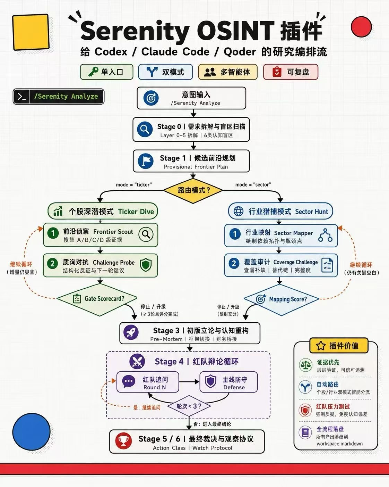

# SOFA

**[中文](README_CN.md) | [English](README.md)**



SOFA 是 **serenitive osint framework analyzor**：一个面向科技股和科技行业研究的开源 agent-assisted OSINT 框架。

它面向受过高等教育、能理解科技和商业逻辑、但不一定写代码的读者。SOFA 帮你让 agent 做供应链依赖映射、卡点主张核验、技术约束到财务影响的翻译，并最终产出一份既能读懂、又能回溯证据链的投资研究报告。

SOFA 会把宽泛的科技投资问题拆成四个更具体的问题：

| 问题 | SOFA 会逼研究过程说明什么 |
|------|----------------------------|
| 卡点在哪里？ | 可能重要的供应链层级、物理依赖、客户认证路径或监管瓶颈。 |
| 证据有多硬？ | 每个关键主张的来源质量、时效性、claim 状态和未解决缺口。 |
| 能不能变成财务现实？ | 收入桥、毛利率路径、现金流影响、稀释风险、估值位置和催化剂时钟。 |
| 什么会推翻 thesis？ | 最强反证、失效触发、替代供应商、技术替代和时间窗口风险。 |

它不是自动交易工具，也不是“输入股票代码就给买卖建议”的黑箱。SOFA 的目标是帮助你做两类剥洋葱式研究：

| 研究模式 | 你想回答的问题 | SOFA 的交付物 |
|----------|----------------|---------------|
| 个股深潜 Ticker Dive | 这家公司到底是不是 AI / 硬科技供应链里的真卡点？ | 证据链、财务传导、红队反证、失效条件、观察协议和最终研究报告 |
| 行业猎捕 Sector Hunt | 一个行业里，哪些环节最可能产生被低估的瓶颈公司？ | 依赖图谱、卡点评分矩阵、分级候选队列和后续深潜建议 |
| Sector-to-Ultra | 行业猎捕后，如何把候选清单变成可执行的个股深潜任务？ | 自动生成的 Ultra Dive packets，进入更严格的 Ticker Dive 流程 |

## Serenity 是谁，SOFA 为什么从这里出发？

Serenity / [@aleabitoreddit](https://x.com/aleabitoreddit) 是一个以 AI、半导体、光通信、CPO、材料和供应链瓶颈研究出圈的公开投资研究账号。她的公开方法最有价值的地方，不是某个单点结论，而是一组可观察的研究动作：从真实下游需求出发，沿芯片、光互连、激光器、衬底、外延片、原材料和专用设备逐层上溯，追问哪个小而硬的物理节点可能影响更大的下游建设。

SOFA 受这种公开研究范式启发，但它不是 Serenity 本人的项目，也不替任何公开收益、持仓或社交媒体叙事背书。这个 repo 关心的是方法：怎样把“发现卡点”变成证据优先、可反驳、可复盘，并且能由现代 agent 协助执行的研究流程。

## SOFA 用来干什么？

- **把科技行业拆开看。** 从终端需求一路拆到材料、设备、认证、客户和监管约束。
- **把个股故事翻译成证据。** 每个关键 claim 都要进 evidence ledger，不让模糊叙事直接变成结论。
- **把发现和定性结论分开。** Sector Hunt 只输出 map 和 ranked queue，不直接给 action-class 结论；候选必须进入 Ticker Dive 或 Ultra Dive。
- **管理 frontier 生命周期。** Stage 2 frontier 可以通过确定性检查被新增、退休、延续和重新激活，而不是停留在冻结的 Stage 1 清单里。
- **让研究过程可回溯。** 工作空间会保存 `research_workflow.md`、`evidence_ledger.md`、`claim_ledger.md`、`search_log.md`、gate checks、method-card traces 和最终报告。
- **写给决策者阅读。** 最终报告先给结论、关键证据、最大反证和下一步，再把详细过程放到正文和附录。

## 为什么是 harness，而不是一个 skill？

很多 Serenity-like agent skill 会试图把一整套投资研究方法压进一个可调用的 prompt。这很方便，但问题也很明显：上下文一长，agent 可能跳步骤；搜索和 thesis 形成容易混在一起；弱证据可能被写成强结论；已经查过什么容易遗忘；最后报告看起来流畅，但过程不可复盘。

SOFA 不是让一个 skill 独自完成所有事情，而是把研究做成一个 harness。用户仍然从一个入口启动，但实际执行由一套分层系统控制：

| 层级 | 做什么 | 为什么重要 |
|------|--------|------------|
| Router | 根据用户意图选择 Ticker Dive、Sector Hunt 或 Sector-to-Ultra。 | 研究单个公司和研究整个行业，流程不应该相同。 |
| Mode guides | 定义每种模式的阶段、循环和完成标准。 | agent 不能自由发挥地跳过 framing、mapping、challenge、financial bridge、red-team 和报告。 |
| Private method cards | 给 subagent 提供供应链映射、客户发现、财务桥、红队等具体方法。 | 用户不会直接调用半上下文的方法卡；主流程决定何时、为何加载。 |
| Deterministic gates | 用脚本做 workspace 初始化、阶段检查、loop enforcement 和 dossier validation。 | 关键检查交给代码，而不是交给 agent 的记忆或自信。 |
| Durable workspace | 把证据、claim、搜索记录、worker 输出、scorecard 和报告落盘。 | 研究可以复查、续跑、质疑和改进。 |
| Host adapters | 把同一套核心流程映射到 Codex、Claude Code 和通用 agent 环境。 | SOFA 不绑定某一个厂商的工具名或运行时。 |

## agent loop 怎么剥洋葱？

SOFA 借鉴了情报界的 intelligence cycle：direction、collection、processing、analysis、dissemination 和 feedback。翻译到投资研究里，它不是“一次搜索、一份报告”，而是不断推进证据边界的循环。

| 循环步骤 | SOFA 中对应什么 |
|----------|-----------------|
| Direction | 澄清研究问题，选择 Ticker Dive 或 Sector Hunt，并从终端需求向上游拆解。 |
| Collection | 搜索公告、filing、技术文档、客户线索、市场数据和可信反方证据。 |
| Processing | 给证据分级，把已确认事实、推断 claim 和待验证缺口分开。 |
| Analysis | 形成 dependency ladder、chokepoint map、financial bridge 和 provisional thesis。 |
| Challenge | 在允许定性结论前，运行 Challenge Probe、Coverage Challenge 和 Formal Red Team。 |
| Dissemination | 输出可读报告和 watch protocol，同时保留审计轨迹。 |
| Feedback | 决定继续、转向、分叉 frontier、生成 Ultra Dive packet，或因为缺少 primary evidence 暂停。 |

这就是 SOFA 和普通单 skill 的核心区别：它不是要求 agent 在一个长 prompt 里“更努力地思考”，而是给 agent 一套循环、角色、文件、门禁和停止规则。

## 适合谁？

- 科技成长股、半导体、AI infrastructure、光通信、先进制造方向的投资者和研究员。
- 能理解科技和商业逻辑、但不一定写代码，希望 agent 负责研究流程和文件纪律的用户。
- 想用 agent 做深度研究，但不想接受黑箱答案的人。
- 需要把 OSINT 过程、证据质量、反证和报告留痕标准化的投研团队。

## 安装与最小启动

SOFA 是一个 framework repo。最小使用不要求你先配置搜索 API 或金融数据 API。

先用 GitHub 的 clone 地址把仓库拉到本地，然后进入 repo：

```bash
cd SOFA
python3 scripts/capability_check.py
```

在 Codex、Claude Code 或其他 agent 中，把下面这个文件作为入口交给 agent：

```text
skills/sofa-analyze/SKILL.md
```

然后初始化一个研究工作空间：

```bash
python3 scripts/init_workspace.py "SIVE" "./workspace/sive" --mode ticker
python3 scripts/init_workspace.py "CPO laser supply-chain bottlenecks" "./workspace/cpo-laser" --mode sector
```

完整安装说明见 [docs/installation.md](docs/installation.md)。不同 agent 的使用映射见 [docs/adapters/](docs/adapters/)。

## 推荐能力，不是强制依赖

SOFA 会检测并建议搜索和金融数据能力，但不会静默安装工具，也不会未经确认写入 API key。

| 能力 | 推荐顺序 |
|------|----------|
| 通用搜索 | AnySearch skill -> Exa MCP server -> Tavily skills / CLI -> host agent built-ins |
| 中文金融数据 | 先阅读 Wind AIFin Market skill 安装说明 |
| 英文 / 全球公开市场数据 | `yfinance` 适合作为研究辅助，公告、filing 和交易所披露仍是权威来源 |

详细配置见 [docs/capability-setup.md](docs/capability-setup.md)。

## 怎么用？

你可以直接把研究目标交给 agent，并明确要求使用 SOFA Analyze：

```text
Use SOFA Analyze for a Ticker Dive on AXTI. Focus on whether InP substrate demand can translate into revenue, margin, catalysts, and invalidation conditions.
```

```text
Use SOFA Analyze for a Sector Hunt on advanced optical interconnect bottlenecks. Produce the dependency ladder, chokepoint matrix, and ranked queue only.
```

```text
Use the Sector-to-Ultra guide to convert the top ranked Sector Hunt candidates into Ultra Dive packets, then ask me which candidate to deep dive.
```

## 输出长什么样？

SOFA 的最终报告不是流水账。推荐结构是：

1. **Executive Readout**：一句话结论、当前 action class 或研究状态、最关键证据、最大反证。
2. **Why This Could Matter**：为什么这个节点可能是卡点，为什么市场可能低估或误解它。
3. **Evidence Map**：证据等级、来源、时效性和待验证 claim。
4. **Financial Bridge**：需求如何进入收入、毛利率、现金流、估值和稀释风险。
5. **Red-Team Results**：最强反对意见、SOFA 如何回应、哪些问题仍未解决。
6. **Watch Protocol**：未来需要跟踪的公告、客户认证、扩产、监管、价格和失效触发器。

报告写作指南见 [docs/report-guide.md](docs/report-guide.md)。

## 研究边界

SOFA 辅助研究，不构成投资建议。它不自动交易，不代替你的判断，不承诺收益，不把社交媒体线索当作事实，不允许 Sector Hunt 直接跳成买卖结论。任何 action-class 语言都必须先完成 Ticker Dive 或 Ultra Dive，并通过 financial bridge、formal red-team、catalyst clock 和 invalidation conditions。

## 深入文档

- [安装说明](docs/installation.md)
- [能力配置](docs/capability-setup.md)
- [报告指南](docs/report-guide.md)
- [架构说明](docs/architecture.md)
- [代码地图](docs/codemap.md)
- [Codex adapter](docs/adapters/codex.md)
- [Claude Code adapter](docs/adapters/claude-code.md)
- [Generic agent adapter](docs/adapters/generic-agent.md)
- [License](LICENSE)
